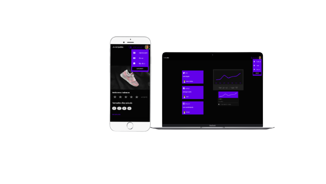

<div align='center'>
 
 
 
  
 
 
 </div>

# # 👷 Tools 👷
 - Vue
 - Vuetify
 - Vue-router

<div align="center">
  
</div>

## Project setup
```
npm install
```
###  Running the application
```
npm run serve
```
 
